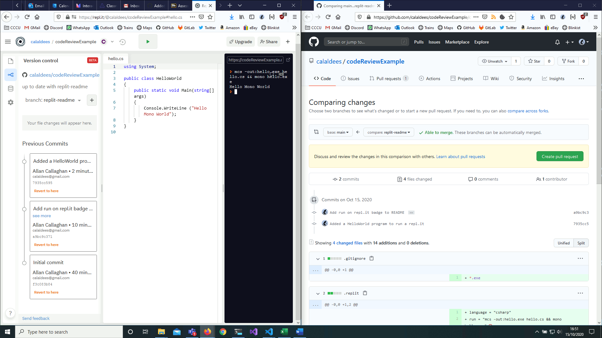

Collaboration
=============

Objectives
----------
* Consider tools/techniques to be a more collaborative teaching practitioner
* Consider ways to facilitate building professional collaboration skills in students

Version Control (30 min)
===============

Demo of (20min)
* Create new repo
* clone repo
* create sub file
* branch
    * create 2 branches
* commit (history)
    * git tree
    * [GitHub/network](https://github.com/calaldees/KaraKara/network)
* Conflict resolution

* Task
    * Code Review [Example GitHub Pull Request](https://github.com/calaldees/codeReviewExample/pull/1)
    * 10min

Teacher Collaboration (15 min)
=====================

### Plain office documents

* Somewhat portable
* Understandable by most people
* Prone to corruption/dataloss
* Transmission
    * Email
    * Website (upload)
    * Dropbox
        * Versions (for 2 weeks)

Problems
* No change log
* Contributing changes back to the author is hard/manual/complex/time-consuming
* fragmented (people have different versions) that are inaccessible from the original
* Difficult to search content (searching for text inside an individual slide of a sideshow)
* Struggle to meet legal accessibility standards
* Data is locked in formats of propriety software

### Cloud Based Office Documents

* Single point of truth always accessible
* Multiple editors
* Comments system

Problems
* Anyone can change anything at anytime
    * Someone could just remove chunks of information you consider important or still need
* Limited log of changes
* Difficult to search text deep in documents
* 3rd Party tech companies control your data

### Version control (with text representation)

* Point of truth always accessible
* Multiple editors
* Contributions go through a review/consultation process
* Every previous version is tracked and accessible
* Content is searchable
* Meets legal accessibility standards

Problems
* Learning curve to make contributions

Student Collaboration (30 min)
=====================

### Online 

* General Documents
    * [Google Docs](https://docs.google.com/)
    * [Microsoft Office 365](https://www.office.com/)
* Shared boards
    * [whiteboard.fi](https://whiteboard.fi/)
    * [Miro](https://miro.com/)
    * [Padlet](https://padlet.com/)
    * [Wireflow](https://wireflow.co/) - Open source collaborative website flow diagrams
* General
    * [hypothes.is](https://web.hypothes.is/) - Annotate the web, with anyone, anywhere
* Setup a Computing Discord/Slack server
    * `#code`,`#cooltech`,`#random`
    * 6th formers moderate?
* Links to calendar entries (for deadlines)

TASK: What other collaboration tools have you encountered that you think could be useful in an school setting?

### Version Control

Benefits of using public code-repositories version-control (GitHub/GitLab)
* As a teacher
    * See timestamped progress
    * Reproduce issue + Offer support as merge request
    * Run automated tests on student code (imagine your marking being automated?)
* As a student
    * Roll back to working versions
    * Experience with professional tools
    * No excuses for loosing work

All on the same team, all with the same objective.
Professional developers SHARE ALL THEIR CODE AT ALL TIMES.

Copying *is* a part of learning. Reading code. Reference sources.
* GCSE: Exam is paper based
* AS: Assessment is solo on a computer
* A2: Project is individual
You will easily be able to spot any student that copies code and submits summative assessment to you without understanding.

#### Online code environments

[repl.it](https://repl.it/) is an education revolution
* No reliance on school infrastructure
* Variety of languages
* Terminal and graphical (pygame) apps
* Multi-user live pair programming
* Simple integration with GitHub version control
    * Spawn repl from a GitHub template (your stub task)
    * Auto marking and Audit/commit history of students work
    * Commenting
    * [GitHub Education](https://education.github.com/teachers)

Other Online online code tools
* Javascript
    * [CodePen](https://codepen.io/)
        * [canvas](https://codepen.io/keenancrane/pen/zKqbpb)
    * [Playcode.io](https://playcode.io/)
    * [JSFiddle](https://jsfiddle.net/)
        * [canvas](https://jsfiddle.net/digitalzebra/yyR2E/)
* Python
    * [Google CoLab](https://colab.research.google.com/)
        * [python](https://colab.research.google.com/notebooks/intro.ipynb)
    * [jupyter](https://jupyter.org/)

Other unsorted notes about Collaboration
========================================

* case studies
    * Karakara - free - austraila adds new features
    * SuperLimitBreak tech stack - free + documented - even is someone copies us - they wont have the ideas
    * Fab** - testers should not look at code

* [How to Write Technical Posts (so people will read them)](https://reasonablypolymorphic.com/blog/writing-technical-posts/)
    * Although not directly related to teaching - the clarity of this article and the points made are universal

[The Advantages of Peer Learning](https://web.archive.org/web/20191115133445/https://blog.hyperlog.club/why-peer-learn/)

